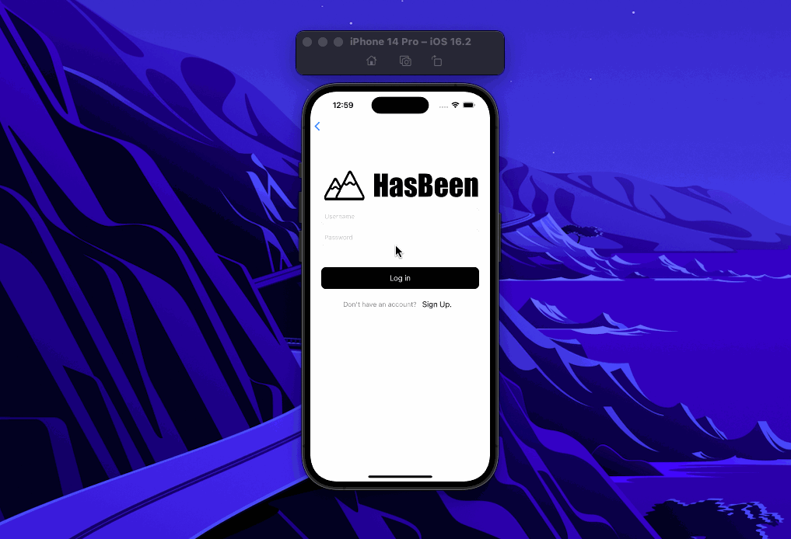
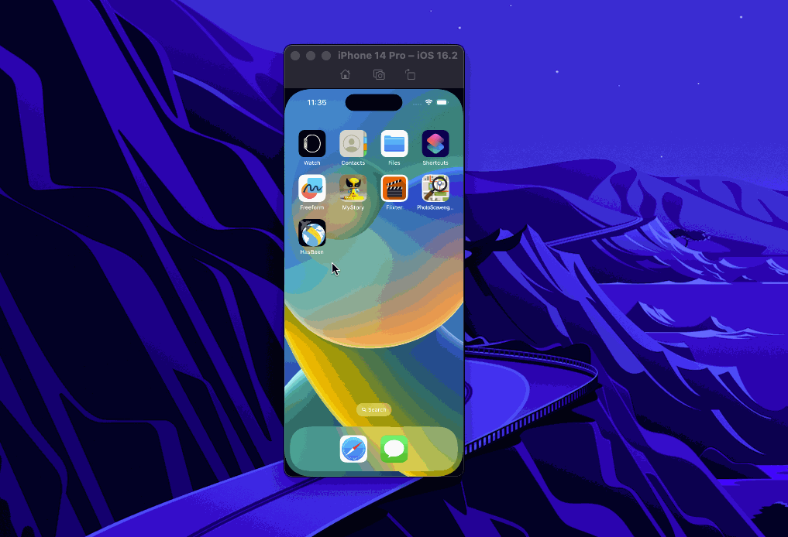
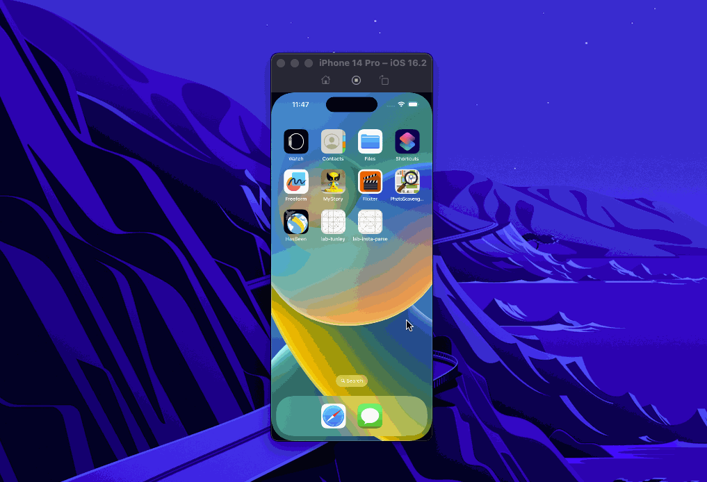

Unit 7: Group Milestone - README
===

# HasBeen

## Table of Contents
1. [Overview](#Overview)
1. [Product Spec](#Product-Spec)
1. [Wireframes](#Wireframes)
1. [Schema](#Schema)
1. [Sprint 1 Summary](#Sprint-1-Summary)
1. [Sprint 1 Walkthrough Gif](#Sprint-1-Walkthrough-GIF)
1. [Sprint 2 Summary](#Sprint-2-Summary)
1. [Sprint 2 Walkthrough Gif](#Sprint-2-Walkthrough-GIF)


## Overview
### Description


HasBeen is a random adventure generator for users searching for things to do near them or in a specified city. HasBeen will include features such as a personal profile, a random button generator for adventures, location services, and many others that will jump you to the most exciting and unique experience. Users can save or bookmark the results of the randomize generator button. In addition, HasBeen will allow users to share their next adventures with others by email or any other messaging service. 


### App Evaluation
- **Category:** Travel / Social Networking
- **Mobile:** This app would mostly be mobile but could also have a web (html/css) interface.
- **Story:** Randomly generates a travel itinerary whenever the user presses the travel button.
- **Market:** Mostly adults (18+) because of the travel focus, but it could also serve as an educational app for teenagers and kids.
- **Habit:** It probably won't be people use as often as TikTok or Twitter, but maybe every few days as a form of escape. People can use it to plan trips or just dream about future trips.
- **Scope:** Mainly for individuals but there is the possibility of favoriting / liking various destinations and then connecting with others based on that.

## Product Spec

### 1. User Stories (Required and Optional)

**Required Must-have Stories**


- [x] As a user, given it is my first time opening the app, when I open the app then I should be prompted to sign up or log in.

- [x] As a user, given I get past the login screen, when I open the app then I should be brought to a home screen with a big clickable randomize button on the screen.

- [ ] As a user, given I am on the home screen, when I click the big randomize button then I will be taken to another page where a random city anywhere in the world will be displayed with suggested places to check out for travelers in that city.

- [ ] As a user, given I have already clicked the big randomize button, when I am displayed the given location then it should be accompanied by an image of the location of the city.

- [ ] As a user, given I have already clicked the big randomize button, when I am displayed the suggestions then they should be organized by some sort of standard like historical, activities, or bodies of water etc.

- [ ] As a user, given I have already clicked the big randomize button, when I click the back button then I should be brought back to the home page where the big randomize button is available to press again.


**Optional Nice-to-have Stories**

- [ ] As a user, given I have already clicked the big randomize button, when I want to save the randomized plan I was just given, then I should be able to click a heart or button to save it to my favorites

- [ ] As a user, given I have favorited something, when I go back to the homepage of the app, then I should be able to access a list of my favorited plans.

- [ ] As a user, given I am on the home screen, when I want to filter the randomize button to any if the seven continents, then I should be able to click a drop down that's below the bottom to allow me to limit the search by continent.

- [ ] As a user, given I have already clicked the big randomize button, when I want to share the randomized ideas, then I should be able to direct message the plan to other users within the app.

- [ ] As a user, given I have logged in, when I want to add other users within the app, then I should be able to using their username with a search button available for adding friends on the home screen.

- [ ] As a user, given I have already clicked the big randomize button, when I want to share the generated ideas to a social media feed, then I should be able to post my results within a feed to other users on the app.


### 2. Screen Archetypes

* Login Screen
   * User can Login
* Sign Up Screen
   * User can sign up to create a new account
* Creation
   * User is given randomize button
   * User clicks button to create randomized location
* Detail
   * User can view random city with more suggested cities for travelers
   * User can see image of the location
   * User can see suggestions are organized by a set standard (historical, activities, bodies of water, etc.)
* Stream
   * User can see all previously saved randomized locations


### 3. Navigation

**Tab Navigation** (Tab to Screen)

* Home / Randomizer
* Saved Locations


**Flow Navigation** (Screen to Screen)

* Login Screen
   => Creation Screen
* Login Screen
   => Sign Up Screen
* Sign Up Screen
   => Creation Screen
* Creation Screen
   => Detail Screen
* Creation Screen
   => Stream Screen 
* Detail Screen
    => Creation Screen
* Stream Screen
   => Creation Screen
* Stream Screen
   => Detail Screen

## Wireframes


### [BONUS] Digital Wireframes & Mockups


### [BONUS] Interactive Prototype



## Schema 
### Models
#### User

   | Property      | Type     | Description |
   | ------------- | -------- | ------------|
   | objectId      | String   | unique id for the user post (required by ParseObject) |
   | createdAt     | DateTime | date when post is created (required by ParseObject)|
   | updatedAt     | DateTime | date when post is last updated (required by ParseObject) |
   | ACL           | ParseACL |  used to control which users can access or modify a particular ParseObject (required by ParseObject) |
   | originalData  | Data    |  inherited from ParseObject (required by ParseObject) |
   | username      | String   | user (required by ParseUser) |
   | email         | String   | user email address (required by ParseUser) |
   | emailVerified | Bool     | boolean indicating whether email is verified (required by ParseUser) |
   | password      | String   | user password (required by ParseUser) |
   | authData       | String Array | inherited from ParseUser (required by ParseUser) |

#### Destination

   | Property      | Type     | Description |
   | ------------- | -------- | ------------|
   | objectId      | String   | unique id for the user post (required by ParseObject) |
   | createdAt     | DateTime | date when post is created (required by ParseObject)|
   | updatedAt     | DateTime | date when post is last updated (required by ParseObject) |
   | ACL           | ParseACL |  used to control which users can access or modify a particular ParseObject (required by ParseObject) |
   | originalData  | Data    |  inherited from ParseObject (required by ParseObject) |
   | name          | String    |  name of destination |
   | user          | String    |  name of user who saved the destination |

### Networking
#### List of Parse network requests by screen
   - Login Screen
      - (Create/Post) Start new user session
         ```swift
         User.login(username: username, password: password) { [weak self] result in

            switch result {
            case .success(let user):
                  print("✅ Successfully logged in as user: \(user)")

                  // Post a notification that the user has successfully logged in.
                  NotificationCenter.default.post(name: Notification.Name("login"), object: nil)

            case .failure(let error):
                  // Show an alert for any errors
                  self?.showAlert(description: error.localizedDescription)
            }
         }
         ```
   - Signup Screen
      - (Create/POST) Create a new user object
         ```swift
         newUser.signup { [weak self] result in

            switch result {
            case .success(let user):

                  print("✅ Successfully signed up user \(user)")

                  // Post a notification that the user has successfully signed up.
                  NotificationCenter.default.post(name: Notification.Name("login"), object: nil)

            case .failure(let error):
                  // Failed sign up
                  self?.showAlert(description: error.localizedDescription)
            }
         }
         ```
   - Saved Destinations (Stream) Screen
      - (Read/GET) Query saved user destinations
         ```swift
         let query = Post.query()
         query.find { [weak self] result in
            switch result {
            case .success(let destinations):
               // Update the local destinations property with fetched posts
               self?.desinations = destinations
            case .failure(let error):
               self?.showAlert(description: error.localizedDescription)
            }

            // Call the completion handler (regardless of error or success, this will signal the query finished)
            // This is used to tell the pull-to-refresh control to stop refreshing
            completion?()
         }
         ```
   - Destination (Detail) Screen
      - (Create/POST) Query saved user destinations
         ```swift
         // Create Post object
         var destination = Post()

         // Set properties
         destination.name = name

         // Set the user as the current user
         destination.user = User.current

         // Save destination (async)
         destination.save { [weak self] result in

            // Switch to the main thread for any UI updates
            DispatchQueue.main.async {
               switch result {
               case .success(let destination):
                  print("✅ Destination Saved! \(destination)")
               case .failure(let error):
                  self?.showAlert(description: error.localizedDescription)
               }
            }
         }
         ```
#### [OPTIONAL: List endpoints if using existing API such as Yelp]
##### Google Places API
- Base URL - [https://maps.googleapis.com/maps/api/place](https://maps.googleapis.com/maps/api/place)

   HTTP Verb | Endpoint | Description
   ----------|----------|------------
    `GET`    | /details | get all details
    `GET`    | details/json?placeID=placeID| return specific place by ID
    `GET`    | /textsearch   | search for a place using plain text
    `GET`    | /textsearch/json?query="place_name" | return placeID

## Sprint 1 Summary
For this sprint we laid the groundwork of our app and implemented the login, logout, and signup features. We also made a few design changes and planned out our next sprint.

## Sprint 1 Walkthrough GIF


## Sprint 2 Summary
For this sprint we continued working on our app by adding the destination detail view and the stream view (favorites). Next sprint we are going to add hotel, restaurant, and map views as well as touch up some of the design features.

## Sprint 2 Walkthrough GIF
