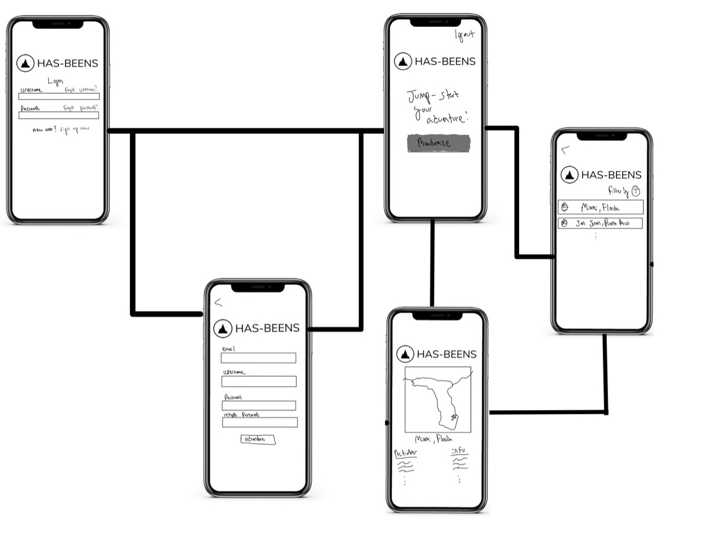
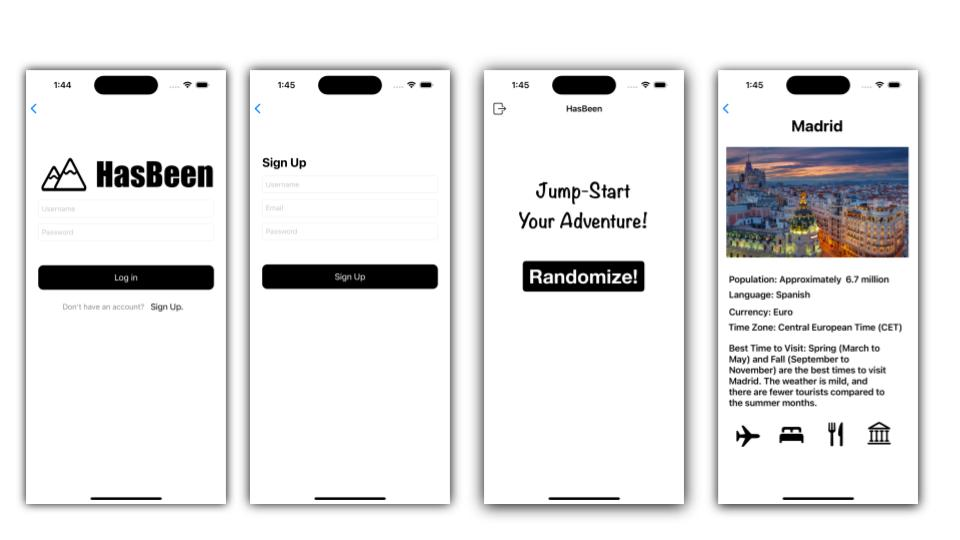

Unit 7: Group Milestone - README
===

# HasBeen

## Table of Contents
1. [Overview](#Overview)
1. [Product Spec](#Product-Spec)
1. [Wireframes](#Wireframes)
2. [Schema](#Schema)

## Overview
### Description

HasBeen is a random adventure generator for users searching for things to do near them or in a specified city. HasBeen will include features such as a personal profile, a random button generator for adventures, location services, and many others that will jump you to the most exciting and unique experience. Users can save or bookmark the results of the randomize generator button. In addition, HasBeen will allow users to share their next adventures with others by email or any other messaging service. 

### App Evaluation
- **Category:** Travel / Social Networking
- **Mobile:** This app would mostly be mobile but could also have a web (html/css) interface.
- **Story:** Randomly generates a travel itinerary whenever the user presses the travel button.
- **Market:** Mostly adults (18+) because of the travel focus, but it could also serve as an educational app for teenagers and kids.
- **Habit:** It probably won't be people use as often as TikTok or Twitter, but maybe every few days as a form of escape. People can use it to plan trips or just dream about future trips.
- **Scope:** Mainly for individuals but there is the possibility of favoriting / liking various destinations and then connecting with others based on that.

## Product Spec

### 1. User Stories (Required and Optional)

**Required Must-have Stories**

* As a user, given it is my first time opening the app, when I open the app then I should be prompted to sign up or log in.

* As a user, given I get past the login screen, when I open the app then I should be brought to a home screen with a big clickable randomize button on the screen.

* As a user, given I am on the home screen, when I click the big randomize button then I will be taken to another page where a random city anywhere in the world will be displayed with suggested places to check out for travelers in that city.

* As a user, given I have already clicked the big randomize button, when I am displayed the given location then it should be accompanied by an image of the location of the city.

* As a user, given I have already clicked the big randomize button, when I am displayed the suggestions then they should be organized by some sort of standard like historical, activities, or bodies of water etc.

* As a user, given I have already clicked the big randomize button, when I click the back button then I should be brought back to the home page where the big randomize button is available to press again.

**Optional Nice-to-have Stories**

* As a user, given I have already clicked the big randomize button, when I want to save the randomized plan I was just given, then I should be able to click a heart or button to save it to my favorites

* As a user, given I have favorited something, when I go back to the homepage of the app, then I should be able to access a list of my favorited plans.

* As a user, given I am on the home screen, when I want to filter the randomize button to any if the seven continents, then I should be able to click a drop down that's below the bottom to allow me to limit the search by continent.

* As a user, given I have already clicked the big randomize button, when I want to share the randomized ideas, then I should be able to direct message the plan to other users within the app.

* As a user, given I have logged in, when I want to add other users within the app, then I should be able to using their username with a search button available for adding friends on the home screen.

* As a user, given I have already clicked the big randomize button, when I want to share the generated ideas to a social media feed, then I should be able to post my results within a feed to other users on the app.

### 2. Screen Archetypes

* Login Screen
   * User can Login
* Sign Up Screen
   * User can sign up to create a new account
* Creation
   * User is given randomize button
   * User clicks button to create randomized location
* Detail
   * User can view random city with more suggested cities for travelers
   * User can see image of the location
   * User can see suggestions are organized by a set standard (historical, activities, bodies of water, etc.)
* Stream
   * User can see all previously saved randomized locations

### 3. Navigation

**Tab Navigation** (Tab to Screen)

* Home / Randomizer
* Saved Locations

**Flow Navigation** (Screen to Screen)

* Login Screen
   => Creation
* Sign Up Screen
   => Creation
* Creation
   => Detail Screen
   => Stream Screen
* Detail Screen
    => Creation
* Stream Screen
   => Creation

## Wireframes

### [BONUS] Digital Wireframes & Mockups

### [BONUS] Interactive Prototype

## Schema 
[This section will be completed in Unit 9]
### Models
[Add table of models]
### Networking
- [Add list of network requests by screen ]
- [Create basic snippets for each Parse network request]
- [OPTIONAL: List endpoints if using existing API such as Yelp]